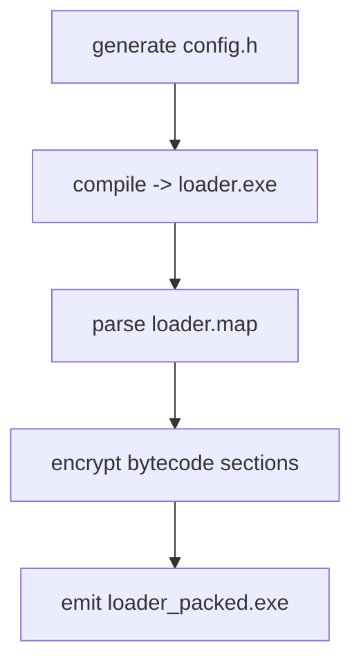

# Agent Loader

> **Modular C2 loader** featuring dynamic function encryption, in-memory payload support, and a covert DoH command channel—fully configurable through a Python builder and a Node.js web panel.

---

## ⚙️ Technical Specifications

- **Function encryption** – decrypt → execute → re-encrypt  
- **Reverse-shell module**  
- **FS-mgr** – search / cache / upload / delete files  
- **Token stealth** – collection & impersonation of user tokens  
- **In-memory payloads** – reflective shellcode or **loadPE** (`.DLL` / `.EXE` / `.NET`)  
- **RWX shellcode execution**  
- **CLI builder** – generate binaries with custom parameters via a Python script  
- **C2 over DNS-over-HTTPS** (Cloudflare / Google / Akamai)  
- **NT/ZW syscall stubs**, minimal WinAPI footprint  
- **VM-based bytecode interpreter** – every build morphs uniquely  
- **Reverse-SOCKS5 proxy** over WebSocket (separate thread)  
- **Anti-VM wrapper + DLL hijack**  
- **OneDrive / Task Scheduler persistence**  
- **Node.js web panel** – bot list, FS-mgr, interactive shell, custom payloads, IP/HWID ban-list  

> *Items marked as “under development” will be shipped in future updates—stay tuned !*

---

## Project Structure

```
/loader          -> client implant
/server          -> C2 server + web panel
/build.py        -> convenient build script
/socks5          -> standalone reverse-proxy test client & server
````

---

## 🛠️ Build Process

```
Prompt values: RSHELL_PORT · SOCKS login/password · DoH server
(Press ↵ to keep each default cached inside the script)
```

| Output file         | Description                     |
| ------------------- | ------------------------------- |
| `loader.exe`        | compiled implant                |
| `loader.map`        | PE map                          |
| `loader_packed.exe` | final, encrypted / packed build |

### 🔒 Building with Encryption (`builder.py`)



1. **Rewrite** `config.h` with CLI parameters.
2. Invoke

   ```bash
   cl /link /MAP:loader.map /OUT:loader.exe
   ```
3. Parse `loader.map`, locate addresses & lengths for every function in **`FUNCS`**.
4. Encrypt those byte ranges → output `loader_packed.exe`.

#### Adding a Function to the Encryption List

1. Append its name to the `FUNCS = [ ... ]` array in *builder.py*.

2. Wrap the call inside code:

   ```cpp
   #include "crypto.h"
   Crypto_Invoke(FuncName, /*LEN*/, 0x5A);
   ```

3. During build, `/*LEN*/` is automatically replaced with the actual byte length.

---

##  Quick-Start Guide (Loader ⇄ Server)

###  Start the Server

```bash
cd server
npm install   # dependencies
npm start     # launches at http://localhost/
```

###  Loader Workflow

1. **Integrity check** (saved state)

2. **Persistence** setup

3. **Token stealth** (steals the first valid token found)

4. Open session → send single **“A”** beacon (online mark)

5. **C2 loop** every 5 s → DoH request → parse response

6. Supported commands:

   | Command           | Action (summary)                                           |
   | ----------------- | ---------------------------------------------------------- |
   | `start_proxy`     | Reverse shell on **RSHELL\_PORT** + reverse SOCKS5 over WS |
   | `stop_proxy`      | Stop both proxy and shell                                  |
   | `list_dir`        | Directory listing                                          |
   | `file_get`        | Read file → buffer → C2                                    |
   | `file_put`        | Base64 → file write                                        |
   | `file_del`        | Delete file / dir                                          |
   | `run_shellcode`   | Decode → RWX → exec                                        |
   | `load_pe`         | Memory-load PE (dll/exe)                                   |
   | `load_dotnet`     | Load .NET assembly via CLR ≥ v4                            |
   | `exec_reflective` | Run reflective PE or shellcode                             |

7. Reverse shell + SOCKS5 start **immediately** at entry point.

8. `stop_proxy` gracefully terminates all modules and exits.

###  Potential Improvements

* Fine-tune the Python builder for easier debugging
* Enhance the web panel UX
* Harden `DllMain` logic
* Expand payload support
* Integrate DLL hijacking fully
* Migrate to pure NT/ZW syscalls (remove WinAPI)
* Finish VM bytecode interpreter

---

## 🚫 Disclaimer

This repository is provided for **educational purposes only** and intended for **authorized security research**.
Use of these materials in unauthorized or illegal activities is **strictly prohibited**.

